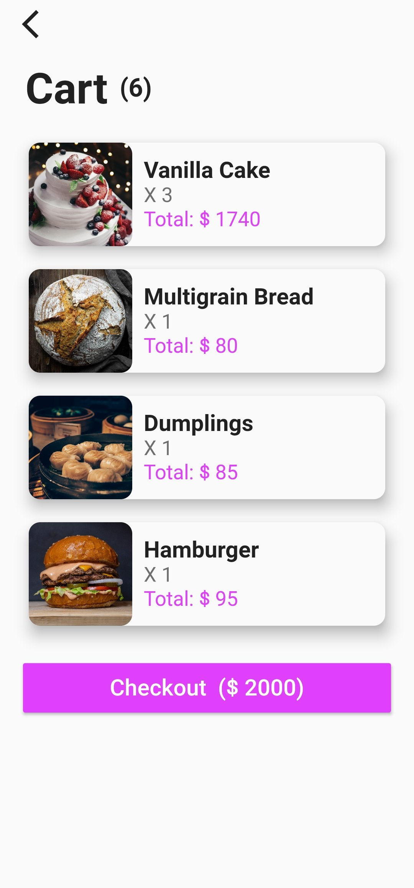

# Olivia's Kitchen
This is an Flutter demo application to demonstrate how to use mobx to perform global state management.

# Screenshots



# Introduction
This application is consisted of four screens: Home, Detail, Cart, and Checkout.<br>

The home page displays the food, and offers some filter conditions for search.<br>

Once the dish is clicked, the application pushs the detail page, showing the ingredient index of the dish. You can choose the number of servings you want to order, and place the order.<br>

You will be taken to the home page once you place your order.<br> 

Now you can see the shopping cart in the top left side can be pressed, and when you press the icon, it takes you to the cart page.<br>

In the cart page, you can see a list of food you ordered earlier, you can press the card to modify it. Then just press the checkout button to go to the checkout page.<br>

In the checkout page, you see the bill and the total of the ingredient indexes. Press the "Go To Homepage" button to navigate back to the home page.<br>

# Dependencies
 - [provider](https://pub.dev/packages/provider)
 - [mobx](https://pub.dev/packages/mobx)
 - [flutter_mobx](https://pub.dev/packages/flutter_mobx)
 - [flutter_launcher_icons](https://pub.dev/packages/flutter_launcher_icons)

# Resources
 - [unsplash](https://unsplash.com/s/photos/unleash)
 - [flaticons](https://www.flaticon.com/)
 - [freepik](https://www.freepik.com/)

# Installation
Type in the commands below in your terminal to initialize this application.

```bash
flutter pub get
```

```bash
flutter packages pub run build_runner build  --delete-conflicting-outputs
```


